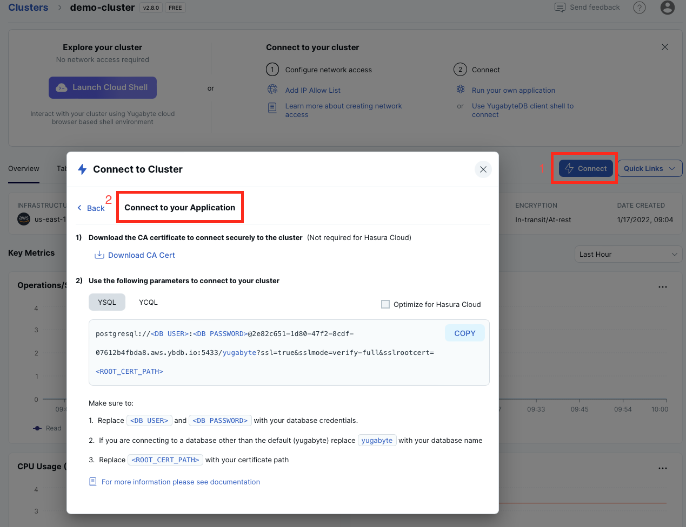

# Simple Go Application for YugabyteDB

The application connects to your YugabyteDB instance via 
[Go PostgreSQL driver](https://docs.yugabyte.com/latest/reference/drivers/ysql-client-drivers/#go-postgresql-driver-pq) and performs basic SQL 
operations. The instructions below are provided for [Yugabyte Cloud](https://cloud.yugabyte.com/) deployments. 
If you use a different type of deployment, then update the `sample-app.go` file with proper connection parameters.

## Prerequisite
* Go version 1.17.6 or later is preffered. Earlier versions should work as well.
* Command line tool or your favourite IDE, such as Visual Studio Code.

## Start Yugabyte Cloud Cluster

* [Start YugabyteDB Cloud](https://docs.yugabyte.com/latest/yugabyte-cloud/cloud-quickstart/qs-add/) instance. Free tier exists.
* Add an IP address of your machine/laptop to the [IP allow list](https://docs.yugabyte.com/latest/yugabyte-cloud/cloud-secure-clusters/add-connections/#manage-ip-allow-lists)

## Clone Application Repository

Clone the application to your machine:

```bash
git clone https://github.com/yugabyte/yugabyte-simple-go-app.git && cd yugabyte-simple-go-app
```

## Provide Yugabyte Cloud Connection Parameters

The application needs to establish a secured connection to your Yugabyte Cloud instance.

Open the `sample-app.go` file and specify the following configuration parameters:
* `host` - the hostname of your Yugabyte Cloud instance.
* `port` - the port number of your instance (the default is `5433`).
* `dbUser` - the username for your instance.
* `dbPassword` - the database password.
* `sslMode` - the SSL mode. Set to `verify-full` for Yugabyte Cloud deployments.
* `sslRootCert` - a full path to your CA root cert (for example, `/Users/dmagda/certificates/root.crt`) 

Note, you can easily find all the settings on the Yugabyte Cloud dashboard:



## Build and Run Application

1. Initialize the `GO111MODULE` variable:
    ```bash
    export GO111MODULE=auto
    ```
2. Import the Go PostgreSQL driver:
    ```bash
    go get github.com/lib/pq
    ```
3. Run the application:
    ```bash
    go run sample-app.go
    ```

Upon successful execution, you will see output similar to the following:

```bash
>>>> Successfully connected to YugabyteDB!
>>>> Successfully created table DemoAccount.
>>>> Selecting accounts:
name = Jessica, age = 28, country = USA, balance = 10000
name = John, age = 28, country = Canada, balance = 9000
>>>> Transferred 800 between accounts.
>>>> Selecting accounts:
name = Jessica, age = 28, country = USA, balance = 9200
name = John, age = 28, country = Canada, balance = 9800
```

## Explore App Logic

Congrats! You've successfully executed a simple Go app that works with Yugabyte Cloud.

Now, explore the source code of `sample-app.go`:
1. `main` function - establishes a connection with your cloud instance via Go PostgreSQL driver.
3. `createDatabase` function - creates a table and populates it with sample data.
4. `selectAccounts` function - queries the data with SQL `SELECT` statements.
5. `transferMoneyBetweenAccounts` function - updates records consistently with distributed transactions.

## Questions or Issues?

Having issues running this application or want to learn more from Yugabyte experts?

Join [our Slack channel](https://communityinviter.com/apps/yugabyte-db/register),
or raise a question on StackOverflow and tag the question with `yugabytedb`!
